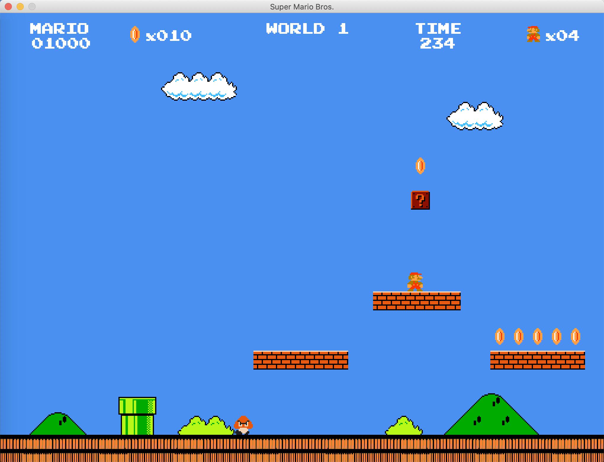

# Super Mario

## How To Start

    1. Open projava/src/_08final_raster/mvc/controller in IntelliJ IDEA
    2. Build porject
    3. Run Game.java

## Requirement

    Java 1.8
    IntelliJ IDEA

## Screenshots

  
  
  
  
  
  
  

